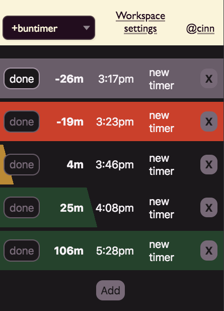

# Buntimer (Earthstar edition)

In development!

This is a visual timer to help you remember to do things throughout the day.  Eating, laundry, appointments.

Each timer has a progress bar that counts down until time runs out, then the whole row turns red and stares you in the face until you click Done.  The progress bar is 60 minutes wide.

After that, done items will be hidden (unless you want to see them).



Each row is stored in a single Earthstar document, as JSON.  This means any change to a row will clobber other simultaneous changes (e.g. you can't have two people changing different parts of a row at the same time).  The use case is mainly personal so this is fine.

We use ephemeral documents that last 7 days to avoid clutter building up.  Normally you will only want to see today's tasks anyway.

Path:
```
    /buntimer-v1/timers/common/${id}!.json
```

TODO:
* CSS transitions for the progress bar colors and gradients
* Click absolute time to edit (currently you can only click the relative time)
* Button to show/hide completed tasks
* Hide tasks from yesterday and older
* Buttons to view previous days' tasks
* Custom color theme for Earthbar
* Hide Earthbar behind a hamburger button
* Make red bars taller so they are more annoying
* Pulse the color of red bars once a minute

---

# Getting Started with Create React App

This project was bootstrapped with [Create React App](https://github.com/facebook/create-react-app).

## Available Scripts

In the project directory, you can run:

### `yarn start`

Runs the app in the development mode.\
Open [http://localhost:3000](http://localhost:3000) to view it in the browser.

The page will reload if you make edits.\
You will also see any lint errors in the console.

### `yarn test`

Launches the test runner in the interactive watch mode.\
See the section about [running tests](https://facebook.github.io/create-react-app/docs/running-tests) for more information.

### `yarn build`

Builds the app for production to the `build` folder.\
It correctly bundles React in production mode and optimizes the build for the best performance.

The build is minified and the filenames include the hashes.\
Your app is ready to be deployed!

See the section about [deployment](https://facebook.github.io/create-react-app/docs/deployment) for more information.

### `yarn eject`

**Note: this is a one-way operation. Once you `eject`, you can’t go back!**

If you aren’t satisfied with the build tool and configuration choices, you can `eject` at any time. This command will remove the single build dependency from your project.

Instead, it will copy all the configuration files and the transitive dependencies (webpack, Babel, ESLint, etc) right into your project so you have full control over them. All of the commands except `eject` will still work, but they will point to the copied scripts so you can tweak them. At this point you’re on your own.

You don’t have to ever use `eject`. The curated feature set is suitable for small and middle deployments, and you shouldn’t feel obligated to use this feature. However we understand that this tool wouldn’t be useful if you couldn’t customize it when you are ready for it.

## Learn More

You can learn more in the [Create React App documentation](https://facebook.github.io/create-react-app/docs/getting-started).

To learn React, check out the [React documentation](https://reactjs.org/).
