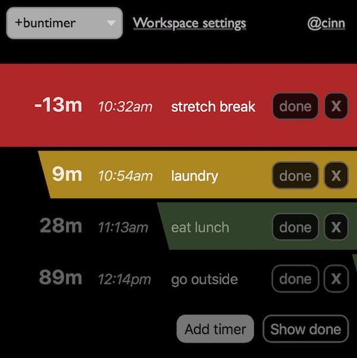

# Buntimer (Earthstar edition)

## What it is

This webapp is a visual timer to help you remember to do things throughout the day:  eating, laundry, appointments.

Each timer has a progress bar that counts down until time runs out, then the whole row turns red and stares you in the face until you click Done.  The progress bar is 60 minutes wide.

After that, done items are hidden (unless you want to see them).



## How to use it

1. Create a workspace.  Name it anything you want.
2. Sign in and create an identity.
3. Now you can add timers and the'll sync to the pub server.
4. Your data will be saved in your browser.  If you want your data to sync to other devices, add pub server(s) in the Workspace Settings.  You can use this one: `https://earthstar-demo-pub-v6-a.glitch.me/` or run your own (see [earthstar-pub](https://github.com/earthstar-project/earthstar-pub)]

Add multiple pub servers if you want redundancy.  They have no authority; they just help keep your data online.  Ask your friends to run some too.

## What's Earthstar?

[Earthstar](https://github.com/earthstar-project/earthstar) is a distributed system for collaborating on data with your friends.  Kind of like SSB or Dat, but simpler and more multi-user.

There is not a big global Earthstar network.  Each workspace and pub are a mini disconnected island, sort of like a Discord or Slack or shared folder.

## Inviting people; Privacy details

You can invite other people to your Buntimer by sending them an invitation (from Workspace Settings).  They can collaborate with you and changes are synced in real time.

Anyone who knows your workspace address, and which pub(s) you use, can see and edit your data.  You can delete your data but some metadata will remain (mostly timestamps).  There's a Data Deletion section at the end of Workspace Settings, or you can just delete your individual timers one by one.

Earthstar is not an append-only system.  Deleted data actually goes away.

## Earthstar tech details

Each timer is stored in a single Earthstar document, as JSON, though it has several properties (name, time, isDone).  This means any change to a timer will clobber other simultaneous changes (e.g. you can't have two people changing different parts of a timer at the same time).  The use case is mainly personal so this is fine.

We use ephemeral documents that last 7 days to avoid clutter building up.  Normally you will only want to see today's tasks anyway.

Document paths look like:
```
    /buntimer-v1/timers/common/${id}!.json
```

TODO:
* Click absolute time to edit (currently you can only click the relative time)
* Hide tasks from yesterday and older
* Buttons to view previous days' tasks
* Hide Earthbar behind a hamburger button
* Pulse the color of red bars once a minute

---
---
---
---
---
---

# Getting Started with Create React App

This project was bootstrapped with [Create React App](https://github.com/facebook/create-react-app).

## Available Scripts

In the project directory, you can run:

### `yarn start`

Runs the app in the development mode.\
Open [http://localhost:3000](http://localhost:3000) to view it in the browser.

The page will reload if you make edits.\
You will also see any lint errors in the console.

### `yarn test`

Launches the test runner in the interactive watch mode.\
See the section about [running tests](https://facebook.github.io/create-react-app/docs/running-tests) for more information.

### `yarn build`

Builds the app for production to the `build` folder.\
It correctly bundles React in production mode and optimizes the build for the best performance.

The build is minified and the filenames include the hashes.\
Your app is ready to be deployed!

See the section about [deployment](https://facebook.github.io/create-react-app/docs/deployment) for more information.

### `yarn eject`

**Note: this is a one-way operation. Once you `eject`, you can’t go back!**

If you aren’t satisfied with the build tool and configuration choices, you can `eject` at any time. This command will remove the single build dependency from your project.

Instead, it will copy all the configuration files and the transitive dependencies (webpack, Babel, ESLint, etc) right into your project so you have full control over them. All of the commands except `eject` will still work, but they will point to the copied scripts so you can tweak them. At this point you’re on your own.

You don’t have to ever use `eject`. The curated feature set is suitable for small and middle deployments, and you shouldn’t feel obligated to use this feature. However we understand that this tool wouldn’t be useful if you couldn’t customize it when you are ready for it.

## Learn More

You can learn more in the [Create React App documentation](https://facebook.github.io/create-react-app/docs/getting-started).

To learn React, check out the [React documentation](https://reactjs.org/).
